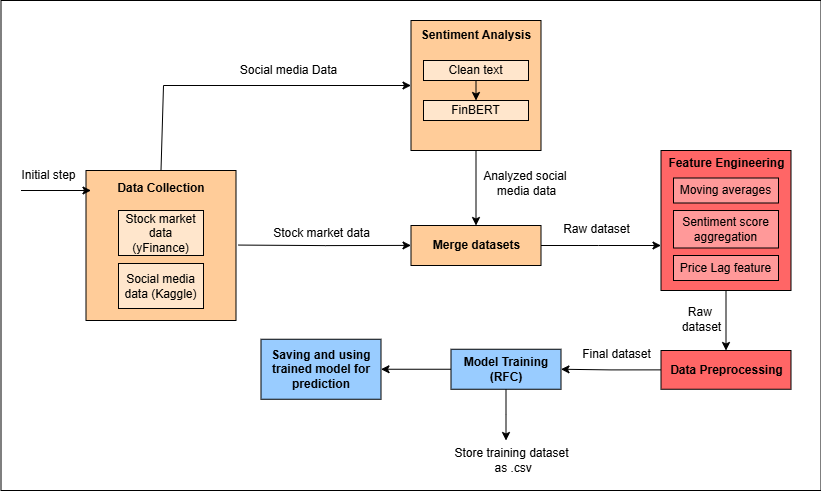
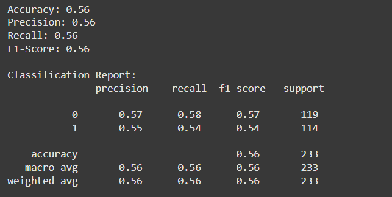

# Analysis of Social Media Trends to Predict Stock Market Movements


## Overview
Stock price movements are influenced by several factors, and having knowledge of these influences will guide investors towards making the right investment decisions. Different social media outlets have a huge influence on market sentiment. Goal of this project is to use social media analysis for predicting stock market trends.

## Model training


## Accuracy metrices


### Installation steps

1. **Clone the repository**
   ```bash
   git clone https://github.com/SmeetHaraniya/Stock-Price-Predictor.git

2. **Create virtual environment & install dependencies**<br>
Create virtual environment
    ```bash
    python -m venv venv
    venv\Scripts\activate
    ```

   Install dependencies
      ```bash
      pip install -r requirements.txt
      ```

3. **Start server**<br>
Open a new terminal start backend server
   ```bash
   python -m uvicorn main:app --reload
   ```

4. **Access the Application**
Open your browser and go to http://localhost:8000 to view the app.

